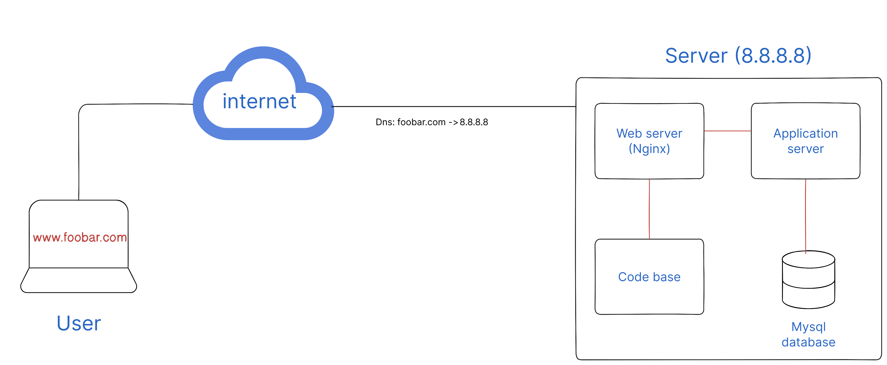

# Design

## Infrastructure Overview

The infrastructure allows a user to access the website "www.foobar.com". Let's explore the specific roles of each component:

- Server: A server is a computer that hosts the web infrastructure. It handles requests from users and responds with the requested web pages or data.
- Domain Name: The domain name, in this case, foobar.com, provides a human-readable address for the website. An A record is provided that maps "foobar.com" to the Ip address (8.8.8.8) While the www record is a CNAME DNS record that provides and alias to "foobar.com" so it points to the server's IP address (8.8.8.8) as well.

- Web Server: Nginx serves as the web server in this infrastructure. It receives incoming requests from users and forwards them to the appropriate application server.

- Application Server: The application server executes the codebase of the website. It processes dynamic content, interacts with the database, and generates web pages to be sent back to the web server for delivery to the user.

- Database: MySQL is used as the database in this infrastructure. It stores and manages the website's data, such as user information, content, and other related information.

- Communication: The server communicates with the user's computer through the HTTP(S) protocol. It receives HTTP requests from the user's web browser and sends back the corresponding HTML, CSS, JavaScript, or other files to render the website.

## Issues with the Infrastructure

While this infrastructure is simple, it has some limitations:

- Single Point of Failure (SPOF): Since there is only one server, any failure or downtime will result in the website becoming inaccessible.
- Downtime during Maintenance: When deploying new code or performing maintenance tasks, the web server needs to be restarted, resulting in temporary downtime for the website.
- Limited Scalability: If the website experiences a significant increase in traffic, a single server may not handle the load efficiently and could lead to performance issues or downtime.
