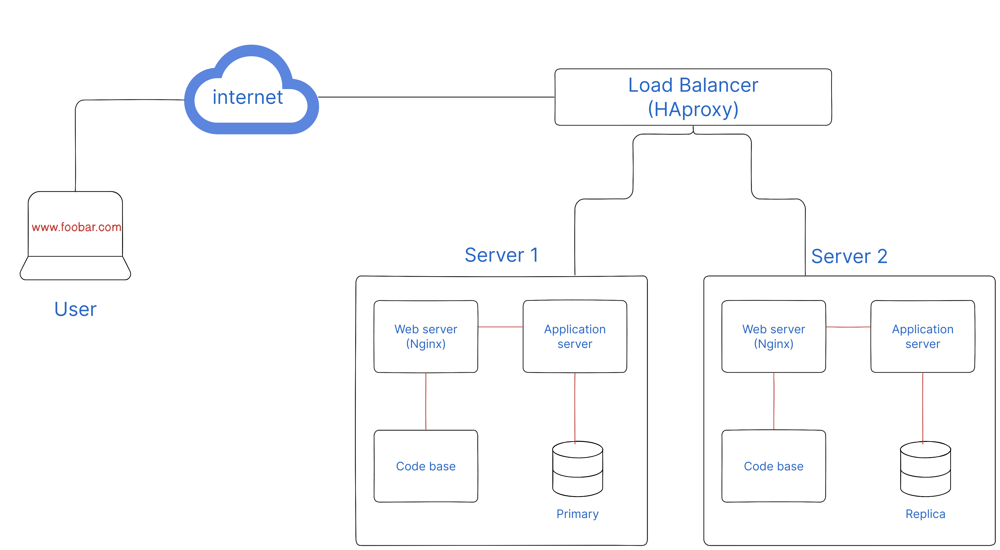

# Design

## Infrastructure Overview

This three-server infrastructure addresses the limitations of the previous design. Let's explore the new components and their roles:

- Load Balancer: HAproxy acts as the load balancer. It distributes incoming traffic across multiple servers to ensure efficient utilization and improved performance. The load balancer uses a distribution algorithm (e.g., round-robin) to determine which server should handle each request.

- Primary-Replica Database Cluster: The MySQL database is configured as a Primary-Replica (Master-Slave) cluster. The Primary node handles write operations, while the Replica nodes replicate the data from the Primary node and handle read operations. This setup improves performance and provides fault tolerance.

### Primary-Replica Database Cluster

In the Primary-Replica database setup, the Primary node handles write operations, ensuring data consistency. The Replica nodes replicate the data from the Primary node and handle read operations, improving read scalability.

### Differences Between Primary and Replica Nodes

- Application Interaction: The application server primarily interacts with the Primary node for write operations, ensuring data consistency. However, it can also interact with the Replica nodes for read operations to distribute the load and enhance performance.

### Issues with the Infrastructure

While this infrastructure is an improvement, it still has some potential issues:

- Single Point of Failure: Although we have multiple servers, the load balancer itself can become a single point of failure. If the load balancer fails, the website may become unavailable.
- Security Issues: The infrastructure lacks a firewall and does not enforce HTTPS, which can expose the system to potential security threats.
- Monitoring: There is no monitoring system in place to track the health, performance, and availability of the servers and services.
