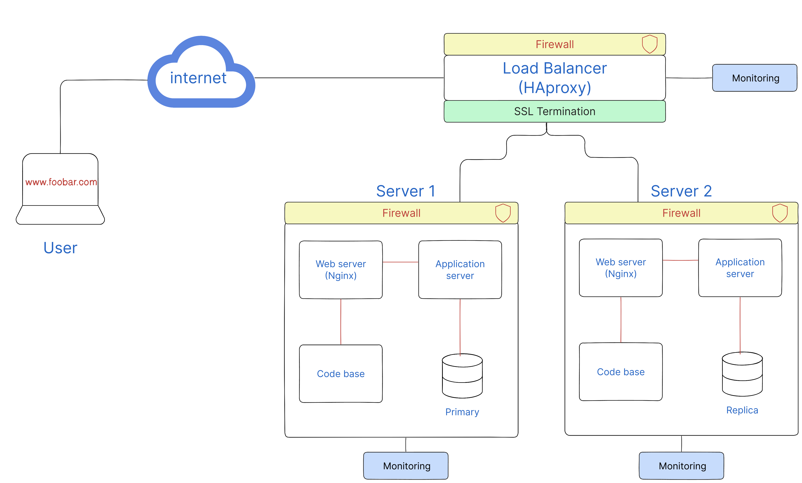

# Design

## Infrastructure Overview

The enhanced web infrastructure consists of the following new elements:

- Firewalls: Three firewalls are integrated into the infrastructure. Firewalls act as a barrier between the servers and external networks, preventing unauthorized access and mitigating potential malicious attacks.

- SSL/TLS Certificate: An SSL/TLS certificate is incorporated to enable HTTPS ensuring secure communication between the web server and the user's browser. HTTPS encrypts data transmission, safeguarding sensitive information from eavesdropping or tampering.

- Monitoring Clients: Three monitoring clients, acting as data collectors, are integrated into the infrastructure. These clients gather vital information about the servers, applications, and network, enabling comprehensive monitoring and analysis.

### Security and Encryption Measures

The following security and encryption measures are implemented:

- Firewalls
- SSL/TLS Encryption

### Monitoring and Data Collection

The monitoring clients play a crucial role in overseeing the infrastructure's health, performance, and availability. They collect relevant data and generate valuable insights for administrators. Specifically:

- Monitoring Tool: The monitoring tool installed on each server collects various metrics such as CPU usage, memory utilization, network traffic, and application-specific statistics. It continuously monitors these parameters and provides real-time visibility into the infrastructure's performance.

- Web Server QPS Monitoring: To monitor the web server's queries per second (QPS), administrators can configure the monitoring tool to track the incoming requests and measure their frequency. This allows them to identify patterns, detect anomalies, and optimize the web server's performance.

## Issues with the Infrastructure

While the enhanced infrastructure offers significant improvements, there are a few potential issues to consider:

- Termination of SSL at Load Balancer Level: Terminating SSL at the load balancer level may pose a security risk. If SSL termination is performed at the load balancer, the encrypted traffic is decrypted before reaching the web servers. This means that the communication between the load balancer and web servers is not encrypted, potentially exposing sensitive data.

- Single MySQL Server for Writes: Having only one MySQL server capable of accepting write operations can become a single point of failure. If this server experiences downtime or performance issues, it can impact the availability and reliability of the entire application.

- Uniformity of Components: Deploying servers with identical components (database, web server, and application server) can lead to scalability and performance limitations. As the workload increases, all components may experience bottlenecks simultaneously, hindering the system's ability to handle higher traffic and potentially causing performance issues.
