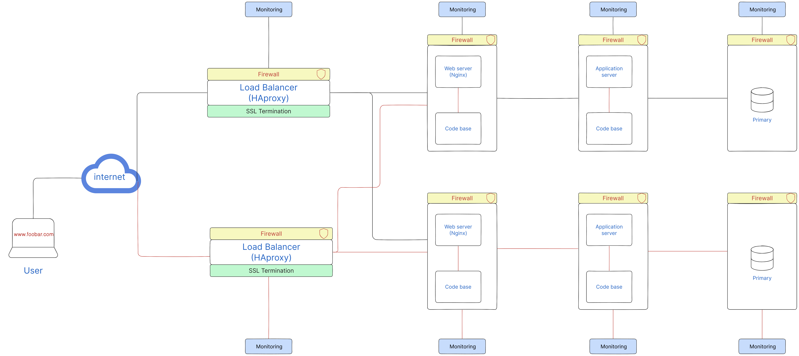

# Design

## Infrastructure Overview

The enhanced web infrastructure now consists of the following components:

- Web Servers: Two dedicated servers handle the web server component. This separation allows for better resource allocation and scalability, ensuring optimal performance for serving web content.

- Application Servers: Two separate servers handle the application server component. Isolating the application logic from the web server enables independent scaling and better utilization of resources.

- Databases: Two databases have been configured as primary databases, allowing for both read and write operations. This active-active setup improves performance, load balancing, and fault tolerance.

- Load Balancers: Two load balancers, configured in a cluster, distribute incoming traffic across the web servers and provide high availability. This setup ensures that if one load balancer fails, the other seamlessly takes over the traffic.

## Infrastructure Issues

While the updated design brings several improvements, it's important to consider potential issues that may arise:

- Increased Complexity: Splitting components onto separate servers and configuring active-active database setups increase the complexity of the infrastructure. This complexity requires careful configuration, monitoring, and management to ensure smooth operation.

- Resource Allocation: While separate servers for each component offer scalability, it's important to monitor resource allocation. Proper monitoring and scaling strategies should be in place to optimize resource usage.
